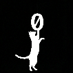

# 🎨 Pixel Art Transformer

<p align="center">
  
</p>

<p align="center">
  
  
  
  
</p>

Convert upscaled pixel art images to their **true pixel dimensions** (1 pixel = 1 pixel).

Takes any upscaled pixel art image, automatically detects the original pixel grid, samples the center color of each cell, and outputs a clean PNG at the real resolution.

## ✨ Features

### Core Features
- 🔍 **Auto-detection** of pixel size using pattern analysis
- 📐 **Grid visualization** overlay with center markers
- 🎯 **Center sampling** for accurate color preservation
- 🚫 **Color exclusion** with tolerance control
- 🎨 **Bit depth reduction** for retro palette effects
- 💾 **Lossless PNG** export with preset sizes (8×8 to 256×256)
- 🖥️ **GUI** and **CLI** interfaces

### Advanced Selection Tools
- 📍 **Define Pixel Mode** - Click and drag over a single pixel to set grid size and offset perfectly
- 🔲 **Area Selection** - Draw rectangles to include/exclude multiple cells
- ✏️ **Contour/Lasso Selection** - Draw polygons around sprites for precise selection
- 📏 **Manual Grid Adjustment** - Drag grid lines to fine-tune alignment

### Export Options
- 📋 **Clipboard Export** - Copy images as Bytes, Base64, NumPy array, or ASCII Bitmap
- 📐 **Preset Sizes** - Export to standard pixel art dimensions (1:1, 8×8, 16×16, 32×32, etc.)
- 💾 **Batch Save** - Save all regions at once

### UI/UX
- 🎨 **Splash Screen** - Professional loading screen with app icon
- 📱 **Responsive Layout** - Scrollable panels for smaller windows
- 🔄 **Smooth Zoom/Pan** - Mouse wheel zoom and drag navigation

## 🚀 Quick Start

### Installation

```bash
# Clone the repository
git clone https://github.com/Zero-AI-Hub/PythonPixelArtTransformer.git
cd PythonPixelArtTransformer

# Install dependencies
pip install -r requirements.txt
```

### Windows
```batch
install.bat
```

### Linux/macOS
```bash
chmod +x install.sh && ./install.sh
```

## 🎮 Usage

### GUI (Recommended)

```bash
python pixel_art_gui.py
```

The GUI provides a wizard-style workflow:
1. **Load** - Select your upscaled pixel art image
2. **Select** - Draw rectangles around sprites/regions
3. **Configure** - Use **Define Pixel** mode for perfect grid alignment
4. **Generate** - Export transformed images in various formats

### Define Pixel Mode (New!)
The easiest way to set up your grid:
1. Select "📍 Definir Píxel" mode
2. Click and drag over ONE pixel in your image
3. Click "✓ Aplicar Píxel"
4. The grid automatically aligns perfectly!

### Command Line

```bash
# Auto-detect pixel size
python pixel_art_transformer.py image.png

# Show grid visualization
python pixel_art_transformer.py image.png --show-grid

# Manual pixel size
python pixel_art_transformer.py image.png --grid-size 16

# Custom output name
python pixel_art_transformer.py image.png -o output.png
```

### Python API

```python
from core import detect_pixel_size, transform_to_real_pixels
from PIL import Image

# Load image
image = Image.open("sprite_sheet.png")

# Auto-detect grid size
cell_size = detect_pixel_size(image)
print(f"Detected: {cell_size}x{cell_size}")

# Transform to true pixels
result = transform_to_real_pixels(
    image, 
    cell_size,
    bit_depth=8,
    excluded_colors=[(255, 0, 255)],  # Exclude magenta
    tolerance=10
)

result.save("sprite_sheet_real.png")
```

## 📁 Project Structure

```
PythonPixelArtTransformer/
├── pixel_art_gui.py          # Main GUI application
├── pixel_art_transformer.py  # CLI application
├── config.py                 # Centralized configuration
├── assets/                   # Application assets
│   └── icon.png             # App icon
├── core/                     # Core processing logic
│   ├── __init__.py
│   ├── transformer.py        # Image processing functions
│   └── exceptions.py         # Custom exceptions
├── gui/                      # GUI components
│   ├── __init__.py
│   ├── canvases.py          # Zoomable canvas widgets
│   ├── grid_editor.py       # Advanced grid editor
│   └── steps.py             # Wizard step frames
├── tests/                    # Test suite
├── examples/                 # Example files
├── requirements.txt          # Production dependencies
└── requirements-dev.txt      # Development dependencies
```

## 🧪 Testing

```bash
# Install dev dependencies
pip install -r requirements-dev.txt

# Run tests
python -m pytest tests/ -v

# With coverage
python -m pytest tests/ -v --cov=core --cov-report=html
```

## 📋 Requirements

- **Python 3.10+**
- **Pillow** >= 9.0.0
- **NumPy** >= 1.21.0
- **tkinter** (included with Python)

## 🔧 Configuration

All settings are centralized in `config.py`:

| Setting | Description |
|---------|-------------|
| `UI_COLORS` | Application color scheme |
| `ZOOM` | Canvas zoom limits and factors |
| `GRID_DETECTION` | Auto-detection thresholds |
| `REGION` | Region selection parameters |
| `COLOR` | Bit depth options |
| `FILE` | Output size presets |

## 🖼️ Example Results

<p align="center">
  
  &nbsp;&nbsp;&nbsp;➡️&nbsp;&nbsp;&nbsp;
  
</p>

<p align="center">
  <em>Original Image (1024×1024)</em> &nbsp;&nbsp;&nbsp;&nbsp;&nbsp;&nbsp;&nbsp;&nbsp;&nbsp;&nbsp; <em>Pixel Art (30×30 → 64×64)</em>
</p>

## 📝 Changelog

### v6.1.0 (2024-12)
- ✨ **Define Pixel Mode** - Click and drag to define grid size/offset
- ✨ **Contour Selection** - Lasso tool for polygon selection
- ✨ **Area Selection** - Rectangle selection tool
- ✨ **Clipboard Export** - Copy as Bytes, Base64, NumPy, Bitmap
- ✨ **Preset Output Sizes** - 1:1 Pixel, 8×8 to 256×256
- ✨ **Splash Screen** - Professional loading screen
- ✨ **App Icon** - Custom application icon
- ✨ **Responsive UI** - Scrollable panels for small windows
- 🐛 Improved grid auto-detection for problematic images

### v6.0.0 (2024-12)
- Complete codebase refactoring
- Modular architecture with `core/` and `gui/` packages
- Centralized configuration in `config.py`
- Custom exceptions for better error handling
- Comprehensive test suite
- Type hints throughout

### v5.0.0
- Initial public release
- GUI with wizard workflow
- CLI with auto-detection
- Grid visualization

## 📄 License

MIT License - feel free to use in your projects!

---

<p align="center">
  Made with ❤️ for pixel art enthusiasts
</p>
